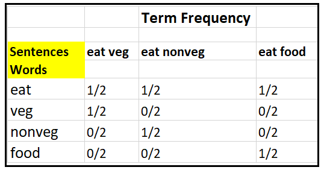

# Natural Language Text Pre-preprocessing

- [Natural Language Text Pre-preprocessing](#natural-language-text-pre-preprocessing)
  - [Introduction](#introduction)
  - [Bags of Word Pipeline](#bags-of-word-pipeline)
  - [Load Data/Corpus](#load-datacorpus)
  - [Tokenization](#tokenization)
  - [Stopwords](#stopwords)
    - [including punctuations](#including-punctuations)
    - [Complete](#complete)
    - [Tokenization using Regular Expression](#tokenization-using-regular-expression)
  - [Stemming](#stemming)
  - [POS(part of speech) tagger](#pospart-of-speech-tagger)
  - [Lemmatization](#lemmatization)
  - [Constructing Vocab & Vectorization](#constructing-vocab--vectorization)
    - [Count Vectorization (AKA One-Hot Encoding)](#count-vectorization-aka-one-hot-encoding)
      - [Basics](#basics)
      - [N-Gram](#n-gram)
    - [TF-IDF Normalization](#tf-idf-normalization)
      - [Intuition](#intuition)
      - [code](#code)


```python
"""
cd .\00text-preprocess\
jupyter nbconvert --to markdown pre-process.ipynb --output README.md
"""
import nltk
# nltk.download()
```

## Introduction

Data preprocessing is an essential step in building a Machine Learning model and depending on how well the data has been preprocessed; the results are seen.

In NLP, text preprocessing is the first step in the process of building a model.
The various text preprocessing steps are:

- Tokenization
- Lower casing
- Stop words removal
- Stemming
- Lemmatization

## Bags of Word Pipeline

- Get the Data/Corpus
- Tokenization,Stop words removal
- Stemming,Lemmatization
- Building a Vocab
- Vectorization
- Classification

## Load Data/Corpus


```python
from nltk.corpus import brown
```


```python
print(brown.categories())
print(len(brown.categories()))

```

    ['adventure', 'belles_lettres', 'editorial', 'fiction', 'government', 'hobbies', 'humor', 'learned', 'lore', 'mystery', 'news', 'religion', 'reviews', 'romance', 'science_fiction']
    15


Most corpora consist of a set of files, each containing a document (or other pieces of text). A list of identifiers for these files is accessed via the `fileids()` method of the corpus reader:


```python
print(brown.fileids()[:20])

```

    ['ca01', 'ca02', 'ca03', 'ca04', 'ca05', 'ca06', 'ca07', 'ca08', 'ca09', 'ca10', 'ca11', 'ca12', 'ca13', 'ca14', 'ca15', 'ca16', 'ca17', 'ca18', 'ca19', 'ca20']


```python
data = brown.sents(categories="fiction")
data

```


    [['Thirty-three'], ['Scotty', 'did', 'not', 'go', 'back', 'to', 'school', '.'], ...]


```python
" ".join(data[1])
```


    'Scotty did not go back to school .'


## Tokenization

Tokenization: Splitting the sentence into words.
Strings can be tokenized into tokens via `nltk.word_tokenize`.


```python
from nltk.tokenize import sent_tokenize,word_tokenize
# prerequisite:nltk.download('punkt')
```


```python
sample_text = "Does this thing really work? Lets see."
```


```python
sent_tokenize(sample_text)
```


    ['Does this thing really work?', 'Lets see.']


```python
words = word_tokenize(sample_text)
words

```


    ['Does', 'this', 'thing', 'really', 'work', '?', 'Lets', 'see', '.']


## Stopwords

Stop words removal: Stop words are very commonly used words (**a, an, the, etc.**) in the documents. These words do not really signify any importance as they do not help in distinguishing two documents. We can use `nltk.corpus.stopwords.words(‘english’)` to fetch a list of `stopwords` in the English dictionary. Then, we remove the tokens that are `stopwords`.


```python
from nltk.corpus import stopwords
```


```python
stop = stopwords.words('english')

print(stop[:20])
```

    ['i', 'me', 'my', 'myself', 'we', 'our', 'ours', 'ourselves', 'you', "you're", "you've", "you'll", "you'd", 'your', 'yours', 'yourself', 'yourselves', 'he', 'him', 'his']


```python
clean_words = [w for w in words if w not in stop ]
print(words)
print(clean_words)

```

    ['Does', 'this', 'thing', 'really', 'work', '?', 'Lets', 'see', '.']
    ['Does', 'thing', 'really', 'work', '?', 'Lets', 'see', '.']


> !! **Watch out for Uppercase**: for example `this` in the above got removed as it is a stopword. But if we would have used `This`, it will not be removed


```python
sample_text = "Does This thing really work? Lets see."
words = word_tokenize(sample_text)
words
```


    ['Does', 'This', 'thing', 'really', 'work', '?', 'Lets', 'see', '.']


```python
clean_words = [w for w in words if w not in stop]
print(words)
print(clean_words)

```

    ['Does', 'This', 'thing', 'really', 'work', '?', 'Lets', 'see', '.']
    ['Does', 'This', 'thing', 'really', 'work', '?', 'Lets', 'see', '.']


> Solution:


```python
sample_text = "Does This thing really work? Lets see."
sample_text = sample_text.lower()
words = word_tokenize(sample_text)
words
```


    ['does', 'this', 'thing', 'really', 'work', '?', 'lets', 'see', '.']


```python
clean_words = [w for w in words if w not in stop]
print(words)
print(clean_words)

```

    ['does', 'this', 'thing', 'really', 'work', '?', 'lets', 'see', '.']
    ['thing', 'really', 'work', '?', 'lets', 'see', '.']


### including punctuations


```python
import string
punctuations = list(string.punctuation)
stop = stop + punctuations
```


```python
clean_words = [w for w in words if w not in stop]
print(words)
print(clean_words)
```

    ['does', 'this', 'thing', 'really', 'work', '?', 'lets', 'see', '.']
    ['thing', 'really', 'work', 'lets', 'see']


### Complete


```python
from nltk.corpus import stopwords
import string
punctuations = list(string.punctuation)
stops = stopwords.words('english')
stops = stops + punctuations


def remove_stopwords(text):
	useful_words = [w for w in text if w not in stops]
	return useful_words
```


```python
sample_text = "Does This thing really work? Lets see."
sample_text = sample_text.lower()
words = word_tokenize(sample_text)
usefull_text = remove_stopwords(words)
usefull_text
```


    ['thing', 'really', 'work', 'lets', 'see']


```python
words = "Does this thing really work? Lets see.".split()
usefull_text = remove_stopwords(words)
usefull_text
```


    ['Does', 'thing', 'really', 'work?', 'Lets', 'see.']


### Tokenization using Regular Expression


```python
from nltk.tokenize import RegexpTokenizer
```


```python
sentence = "Send all the 50 documents related to chapters 1,2,3 at prateek@cb.com"
# include all words(caputare @ also), exclude numbers
tokenizer = RegexpTokenizer('[a-zA-Z@]+')
useful_text = tokenizer.tokenize(sentence)
" ".join(useful_text)

```


    'Send all the documents related to chapters at prateek@cb com'


## Stemming


Stemming: It is a process of transforming a word to its root form.

- Process that transforms particular words(verbs,plurals)into their radical form
- Preserve the semantics of the sentence without increasing the number of unique tokens
- • Example - `jumps, jumping, jumped, jump` ==> `jump`

We stem the tokens using `nltk.stem.porter.PorterStemmer`  to get the stemmed tokens.


```python
from nltk.stem import PorterStemmer
porter = PorterStemmer()
porter.stem("having")
```


    'have'


```python
words = ["play", "playing", "player", "played"]

stemmed_words = [porter.stem(w) for w in words]
stemmed_words

```


    ['play', 'play', 'player', 'play']


```python
words = ["machine","happying"]

stemmed_words = [ps.stem(w) for w in words]
stemmed_words
```


    ['machin', 'happi']


Explanation: The word `'machine'` has its suffix `'e'` chopped off. The stem does not make sense as it is not a word in English. This is a disadvantage of stemming.


`SnowballStemmer` and `LancasterStemmer`:


```python
from nltk.stem import PorterStemmer
from nltk.stem import LancasterStemmer

```


```python
porter = PorterStemmer()
lancaster = LancasterStemmer()
word_list = ["friend", "friendship", "friends", "friendships", "stabil",
             "destabilize", "misunderstanding", "railroad", "moonlight", "football"]
print("{0:20}{1:20}{2:20}".format(
    "Word", "Porter Stemmer", "lancaster Stemmer"))
for word in word_list:
    print("{0:20}{1:20}{2:20}".format(
        word, porter.stem(word), lancaster.stem(word)))

```

    Word                Porter Stemmer      lancaster Stemmer
    friend              friend              friend
    friendship          friendship          friend
    friends             friend              friend
    friendships         friendship          friend
    stabil              stabil              stabl
    destabilize         destabil            dest
    misunderstanding    misunderstand       misunderstand
    railroad            railroad            railroad
    moonlight           moonlight           moonlight
    football            footbal             footbal


`nltk` introduced `SnowballStemmers` that are used to create `non-English`


```python
from nltk.stem.snowball import SnowballStemmer

englishStemmer=SnowballStemmer("english")
englishStemmer.stem("generously")
```


    'generous'


The ‘english’ stemmer is better than the original ‘porter’ stemmer.


```python
porter.stem("generously")

```


    'gener'


## POS(part of speech) tagger

We can use `nltk.pos_tag` to retrieve the `part of speech` of each token in a list.

pos_tag **abbreviations**:

- NNP:		proper noun, singular (sarah)
- NNS: noun, common, plural
- NNPS:		proper noun, plural (indians or americans)
- PDT:		predeterminer (all, both, half)
- POS:		possessive ending (parent\ ‘s)
- DT: determiner
- .....

[https://stackoverflow.com/questions/15388831/what-are-all-possible-pos-tags-of-nltk](https://stackoverflow.com/questions/15388831/what-are-all-possible-pos-tags-of-nltk)


```python
from nltk import pos_tag
pos_tag(['any'])
```


    [('any', 'DT')]


> Watch Out: post_tag takes `list` not  `string`

load text:


```python
from nltk.corpus import state_union
# Prerequisite:
# nltk.download('state_union')
```


```python
documents = nltk.corpus.state_union.fileids()
print(documents[:20])
```

    ['1945-Truman.txt', '1946-Truman.txt', '1947-Truman.txt', '1948-Truman.txt', '1949-Truman.txt', '1950-Truman.txt', '1951-Truman.txt', '1953-Eisenhower.txt', '1954-Eisenhower.txt', '1955-Eisenhower.txt', '1956-Eisenhower.txt', '1957-Eisenhower.txt', '1958-Eisenhower.txt', '1959-Eisenhower.txt', '1960-Eisenhower.txt', '1961-Kennedy.txt', '1962-Kennedy.txt', '1963-Johnson.txt', '1963-Kennedy.txt', '1964-Johnson.txt']


```python
speech  = state_union.raw('2006-GWBush.txt')
speech[:500]
```


    "PRESIDENT GEORGE W. BUSH'S ADDRESS BEFORE A JOINT SESSION OF THE CONGRESS ON THE STATE OF THE UNION\n \nJanuary 31, 2006\n\nTHE PRESIDENT: Thank you all. Mr. Speaker, Vice President Cheney, members of Congress, members of the Supreme Court and diplomatic corps, distinguished guests, and fellow citizens: Today our nation lost a beloved, graceful, courageous woman who called America to its founding ideals and carried on a noble dream. Tonight we are comforted by the hope of a glad reunion with the hus"


```python
speech_in_words = word_tokenize(speech)
pos = pos_tag(speech_in_words)
pos[:10]
```


    [('PRESIDENT', 'NNP'),
     ('GEORGE', 'NNP'),
     ('W.', 'NNP'),
     ('BUSH', 'NNP'),
     ("'S", 'POS'),
     ('ADDRESS', 'NNP'),
     ('BEFORE', 'IN'),
     ('A', 'NNP'),
     ('JOINT', 'NNP'),
     ('SESSION', 'NNP')]


## Lemmatization

**Lemmatization**: Unlike stemming, lemmatization reduces the words to a word existing in the language.

For lemmatization to resolve a word to its `lemma`, **`part of speech` of the word is required**. This helps in transforming the word into a proper root form. However, for doing so, it requires extra computational linguistics power such as a **part of speech tagger**.

[what-is-the-difference-between-stemming-and-lemmatization/](https://blog.bitext.com/what-is-the-difference-between-stemming-and-lemmatization/)

Lemmatization is preferred over Stemming because lemmatization does a morphological analysis of the words.


```python
from nltk.stem import WordNetLemmatizer
lemmatizer = WordNetLemmatizer()
```


```python
lemmatizer.lemmatize("bats")
```


    'bat'


```python
sentence = "The striped bats are hanging on their feet for best"
# Tokenize: Split the sentence into words
word_list = nltk.word_tokenize(sentence)
print(word_list)
# Lemmatize list of words and join
lemmatized_output = ' '.join([lemmatizer.lemmatize(w) for w in word_list])
print(lemmatized_output)
```

    ['The', 'striped', 'bats', 'are', 'hanging', 'on', 'their', 'feet', 'for', 'best']
    The striped bat are hanging on their foot for best


Notice it didn’t do a good job. Because, `‘are’` is not converted to` ‘be’` and `‘hanging’` is not converted to `‘hang’` as expected. This can be corrected if we provide the correct **‘part-of-speech’ tag (`POS` tag)** as the second argument to `lemmatize()`. Sometimes, the same word can have a multiple lemmas based on the meaning / context.


```python
lemmatizer.lemmatize("painting", pos='n')
```


    'painting'


```python
lemmatizer.lemmatize("painting", pos='v')
```


    'paint'


```python
lemmatizer.lemmatize("hanging", pos='v')

```


    'hang'


```python
lemmatizer.lemmatize("are", pos='v')
```


    'be'


```python
lemmatizer.lemmatize("is", pos='v')
```


    'be'


```python
w = "hanging"
postag = pos_tag([w])
postag

```


    [('hanging', 'VBG')]


Simple Function to convert `pos_tag` abbreviations to simple form that the `lemmatize()` function takes. For example `NN`,`NNS` etc to (`n`), `VBG` etc to `v`


```python
from nltk.corpus import wordnet
def get_simple_pos(tag):

	if tag.startswith("J"):
		return wordnet.ADJ
	elif tag.startswith("V"):
		return wordnet.VERB
	elif tag.startswith("N"):
		return wordnet.NOUN
	elif tag.startswith("R"):
		return wordnet.ADV
	else:
		return wordnet.NOUN

```


```python
w="hanging"
postag = pos_tag([w])
print(postag)
print(postag[0][1]+" --> ",end="" )
pos = get_simple_pos(postag[0][1])
print(pos)

```

    [('hanging', 'VBG')]
    VBG --> v


```python
sentence = "The striped bats are hanging on their feet for best"
word_list = nltk.word_tokenize(sentence)
o = []
for w in word_list:
	postag = pos_tag([w])
	pos = get_simple_pos(postag[0][1])
	clean_word = lemmatizer.lemmatize(w, pos=pos)
	o.append(clean_word)

print(o)


```

    ['The', 'strip', 'bat', 'be', 'hang', 'on', 'their', 'foot', 'for', 'best']


[https://www.machinelearningplus.com/nlp/lemmatization-examples-python/](https://www.machinelearningplus.com/nlp/lemmatization-examples-python/)

## Constructing Vocab & Vectorization

### Count Vectorization (AKA One-Hot Encoding)


#### Basics

One of the most basic ways we can numerically represent words is through the one-hot encoding method (also sometimes called count vectorizing).

The idea is super simple.
- **Create a vector that has as many dimensions as your corpora has unique words**.
- Each unique word has a unique dimension and will be represented by a `1` in that dimension with `0s` everywhere else.

The result of this? Really huge and **sparse vectors** that capture absolutely no relational information. It could be useful if you have no other option. But we do have other options, if we need that semantic relationship information.

<div align="center">

</div>


```python
corpus = [
	"This is good",
	"This is bad",
	"awesome This is awesome"
]

```


```python
from sklearn.feature_extraction.text import CountVectorizer
vectorizer = CountVectorizer()
```


```python
vectorizer.fit(corpus)

```


    CountVectorizer()


```python
# Now, we can inspect how our vectorizer vectorized the text
# This will print out a list of words used, and their index in the vectors
print('Vocabulary: ')
print(vectorizer.vocabulary_)
print(vectorizer.vocabulary_.keys())
```

    Vocabulary:
    {'this': 4, 'is': 3, 'good': 2, 'bad': 1, 'awesome': 0}
    dict_keys(['this', 'is', 'good', 'bad', 'awesome'])


```python
# If we would like to actually create a vector, we can do so by passing the
# text into the vectorizer to get back counts
vector = vectorizer.transform(corpus)

```


```python
# Our final vector:
print('Full vector: ')
print(vector.toarray())
```

    Full vector:
    [[0 0 1 1 1]
     [0 1 0 1 1]
     [2 0 0 1 1]]


> Fit + Transform:


```python
vectorized_corpus = vectorizer.fit_transform(corpus).toarray()
vectorized_corpus

```


    array([[0, 0, 1, 1, 1],
           [0, 1, 0, 1, 1],
           [2, 0, 0, 1, 1]], dtype=int64)


> Reverse Mapping


```python
vectorizer.inverse_transform(vectorized_corpus)
```


    [array(['good', 'is', 'this'], dtype='<U7'),
     array(['bad', 'is', 'this'], dtype='<U7'),
     array(['awesome', 'is', 'this'], dtype='<U7')]


#### N-Gram

`N-gram `can be defined as the **contiguous sequence of n items** from a given sample of text or speech. The items can be letters, words, or base pairs according to the application. The N-grams typically are collected from a text or speech corpus (A long text dataset). An `N-gram` of size `1` is referred to as a `“unigram“`, size `2` is a `“bigram”`, size `3` is a `“trigram”`.

<div align="center">

</div>

> Why N-gram?


An N-gram plays important role in text analysis in Machine Learning. Sometimes a **single word alone** isn’t sufficient to observe the *context* of a text. Let’s see how N-gram will useful for text analysis using an example.

For example, we need to predict the sentiment of the text such as positive or negative.

`text = “The Margherita pizza is not bad taste”`

If we consider `unigram` or a single word for text analysis, the negative word `“bad”` lead to the wrong prediction of the text. But if we use `bigram`,  the bigram word `“not bad”` helps to predict the text as a positive sentiment.


<div align="center">

</div>


```python
corpus = [
	"This is good movie",
	"This is good movie but actor is not present",
	"this is not good movie"
]
```


```python
cv = CountVectorizer()
```


```python
vectorized_corpus = cv.fit_transform(corpus).toarray()
vectorized_corpus

```


    array([[0, 0, 1, 1, 1, 0, 0, 1],
           [1, 1, 1, 2, 1, 1, 1, 1],
           [0, 0, 1, 1, 1, 1, 0, 1]], dtype=int64)


```python
cv.vocabulary_.keys()
```


    dict_keys(['this', 'is', 'good', 'movie', 'but', 'actor', 'not', 'present'])


```python
cv = CountVectorizer(ngram_range=(2,3))
vectorized_corpus = cv.fit_transform(corpus).toarray()
vectorized_corpus
```


    array([[0, 0, 0, 0, 1, 0, 1, 1, 0, 0, 0, 0, 0, 0, 0, 0, 1, 1, 0],
           [1, 1, 1, 1, 1, 1, 1, 1, 1, 0, 1, 1, 1, 0, 0, 1, 1, 1, 0],
           [0, 0, 0, 0, 1, 0, 0, 0, 1, 1, 0, 0, 0, 1, 1, 0, 1, 0, 1]],
          dtype=int64)


```python
cv.vocabulary_.keys()

```


    dict_keys(['this is', 'is good', 'good movie', 'this is good', 'is good movie', 'movie but', 'but actor', 'actor is', 'is not', 'not present', 'good movie but', 'movie but actor', 'but actor is', 'actor is not', 'is not present', 'not good', 'this is not', 'is not good', 'not good movie'])


### TF-IDF Normalization

#### Intuition

**Bag of Words** just creates a set of vectors containing the count of **word** occurrences in the sentences/corpus , **but it does not contain information on important words**.

So we have another technique to achieve the words importance is called `TF-IDF` which means `Term Frequency` and `Inverse Document Frequency`, is a scoring measure widely used in information retrieval (IR) or summarization. TF-IDF is intended to reflect **how relevant a term is in a given document**.

- **Avoid features that occur very often**, because they contain less information
- **Information decreases as the number of occurrences increases** across different type of documents
- So we define another term: term-document-frequency which associates a weight with every term

<div align="center">

</div>

> Understanding TF-IDF in Details with example:

Let’s say we have sentences like below

1. He is eating Veg
2. She is eating NonVeg
3. Both are eating Food

After Applying data cleansing technique and apply stop words we will get below sentences words and there count.


| Sentences |
| --------- |
| eat veg   |
| eat noveg |
| eat food  |

Frequency:

| Words | Frequency |
| ----- | --------- |
| eat   | 3         |
| veg   | 1         |
| noveg | 1         |
| food  | 1         |

Lets see the formula to calculate `Term Frequency (TF)`

<div align="center">

</div>

Lets calculate Term Frequency for our sentences

<div align="center">

</div>

Lets see the formula to calculate `Inverse Document Frequency(IDF)`

<div align="center">

</div>

Lets Calculate `Inverse Document Frequency(IDF)` for our words in sentences

<div align="center">

</div>

Now to Calculate `TF-IDF` ,multiply TF table generated above with IDF : `TF-IDF = TF * IDF`


<div align="center">

</div>

After Simplifying we get below table of `TF * IDF `Matrix

<div align="center">

</div>

Here we can see that in `sentence1(eat veg)`,word `“veg”` is given **importance** similarly in `sentence(eat nonveg)`,word `“nonveg”` is given importance and in `sentence3(eat food)`,word `“food”` is given importance and its having some form of semantic meaning.

Word `“eat”` is not given that much importance as its frequently available in all the sentences and can have same meaning and so not useful.

[source](https://medium.datadriveninvestor.com/tf-idf-in-natural-language-processing-8db8ef4a7736)

#### code


```python
corpus = [
	"eating Veg",
	"eating NonVeg",
	"eating Food"
]
```


```python
from sklearn.feature_extraction.text import TfidfVectorizer
```


```python
tfidf = TfidfVectorizer()
```


```python
vc = tfidf.fit_transform(corpus).toarray()
vc
```


    array([[0.50854232, 0.        , 0.        , 0.861037  ],
           [0.50854232, 0.        , 0.861037  , 0.        ],
           [0.50854232, 0.861037  , 0.        , 0.        ]])


Sklearn's Calculation is deferent. To learn more see [“Sklearn’s TF-IDF” vs “Standard TF-IDF”](https://towardsdatascience.com/how-sklearns-tf-idf-is-different-from-the-standard-tf-idf-275fa582e73d?gi=4a3f2f24f5ca)


```python
print(tfidf.vocabulary_)

```

    {'eating': 0, 'veg': 3, 'nonveg': 2, 'food': 1}


```python
tfidf.inverse_transform(vc)
```


    [array(['eating', 'veg'], dtype='<U6'),
     array(['eating', 'nonveg'], dtype='<U6'),
     array(['eating', 'food'], dtype='<U6')]


|               | w1         | w2       | w3                | w4       |
| ------------- | ---------- | -------- | ----------------- | -------- |
| Sentence      | eating     | food     | nonveg            | veg      |
| eating Veg    | 0.50854232 | 0        | 0                 | 0.861037 |
| eating NonVeg | 0.50854232 | 0        | 0.861037        0 | 0        |
| eating Food   | 0.50854232 | 0.861037 | 0                 | 0        |

