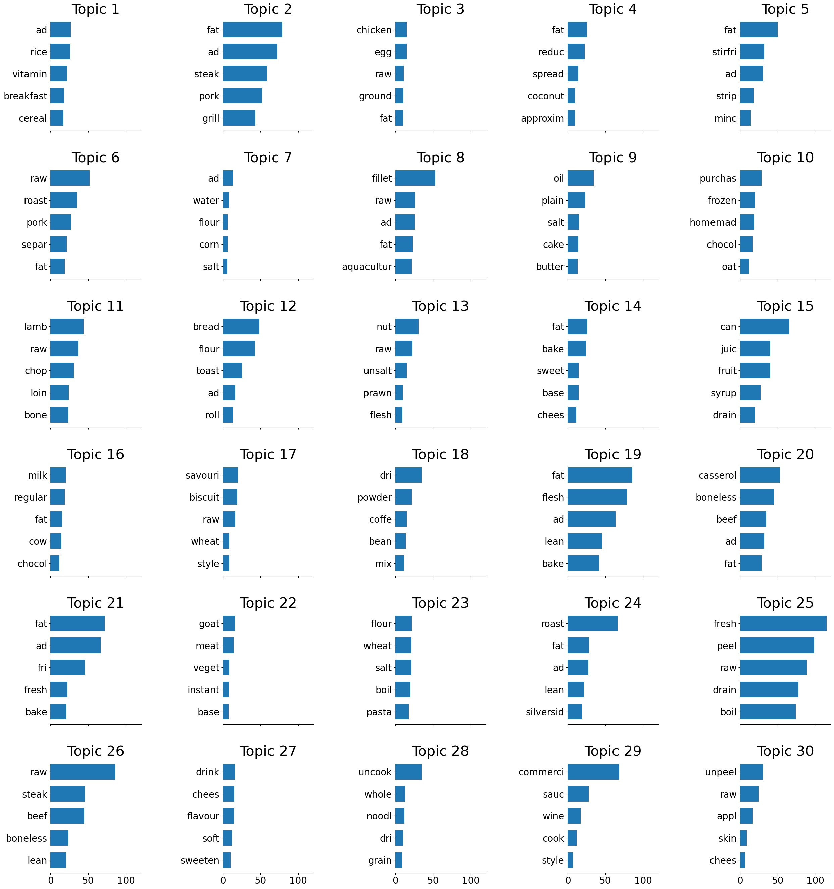
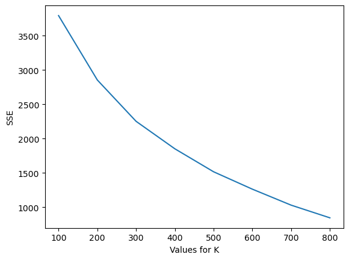

# Text Clustering

- [Text Clustering](#text-clustering)
  - [Resource](#resource)
  - [Prepossessing](#prepossessing)
  - [LDA](#lda)
  - [K-means clustering](#k-means-clustering)
  - [Treemap Charts with plotly](#treemap-charts-with-plotly)


```python
"""
cd 05text_clustering
jupyter nbconvert --to markdown text-clustering.ipynb --output README.md

 """
```

## Resource


- [https://towardsdatascience.com/clustering-product-names-with-python-part-1](https://towardsdatascience.com/clustering-product-names-with-python-part-1-f9418f8705c8?gi=3b31358c9b1a)
- [https://towardsdatascience.com/clustering-product-names-with-python-part-2](https://towardsdatascience.com/clustering-product-names-with-python-part-2-648cc54ca2ac)


## Prepossessing


```python
import pandas as pd
import numpy as np
from matplotlib import pyplot as plt
%matplotlib inline
import plotly.express as px

#Libraries for preprocessing
from gensim.parsing.preprocessing import remove_stopwords
import string
from nltk.stem import PorterStemmer
from nltk.tokenize import word_tokenize
import webcolors

#Download once if using NLTK for preprocessing
# import nltk
# nltk.download('punkt')

#Libraries for vectorisation
from sklearn.feature_extraction.text import CountVectorizer, TfidfVectorizer
from sklearn.decomposition import LatentDirichletAllocation
from sklearn.model_selection import GridSearchCV
from fuzzywuzzy import fuzz

#Libraries for clustering
from sklearn.cluster import KMeans

#Load data set
df = pd.read_csv('Food Details.csv')
df.columns
```


    Index(['Public Food Key', 'Food Profile ID', 'Derivation', 'Food Name',
           'Food Description', 'Sampling Details', 'Nitrogen Factor', 'Fat Factor',
           'Specific Gravity', 'Analysed Portion', 'Unanalysed Portion',
           'Classification', 'Classification Name'],
          dtype='object')


```python
text1 = df['Food Name']
#Remove stopwords, punctuation and numbers
text2 = [remove_stopwords(x)\
        .translate(str.maketrans('','',string.punctuation))\
        .translate(str.maketrans('','',string.digits))\
        for x in text1]
```


```python
#Stem and make lower case
def stemSentence(sentence):
    porter = PorterStemmer()
    token_words = word_tokenize(sentence)
    stem_sentence = [porter.stem(word) for word in token_words]
    return ' '.join(stem_sentence)

text3 = pd.Series([stemSentence(x) for x in text2])
```


```python
#Remove colours
colors = list(webcolors.CSS3_NAMES_TO_HEX)
colors = [stemSentence(x) for x in colors if x not in ('bisque','blanchedalmond','chocolate','honeydew','lime',
                                         'olive','orange','plum','salmon','tomato','wheat')]
text4 = [' '.join([x for x in string.split() if x not in colors]) for string in text3]
```


```python
text4[:2]
```


    ['cardamom seed dri ground', 'cinnamon dri ground']


```python
#Bag of words
vectorizer_cv = CountVectorizer(analyzer='word')
X_cv = vectorizer_cv.fit_transform(text4)
```


```python
#TF-IDF (n-gram level)
vectorizer_ntf = TfidfVectorizer(analyzer='word',ngram_range=(1,2))
X_ntf = vectorizer_ntf.fit_transform(text4)
```

## LDA


```python
#LDA
lda = LatentDirichletAllocation(n_components=30, learning_decay=0.9)
X_lda = lda.fit(X_cv)

#Plot topics function. Code from: https://scikit-learn.org/stable/auto_examples/applications/plot_topics_extraction_with_nmf_lda.html
def plot_top_words(model, feature_names, n_top_words, title):
    fig, axes = plt.subplots(6, 5, figsize=(30, 30), sharex=True)
    axes = axes.flatten()
    for topic_idx, topic in enumerate(model.components_):
        top_features_ind = topic.argsort()[:-n_top_words - 1:-1]
        top_features = [feature_names[i] for i in top_features_ind]
        weights = topic[top_features_ind]

        ax = axes[topic_idx]
        ax.barh(top_features, weights, height=0.7)
        ax.set_title(f'Topic {topic_idx +1}',
                     fontdict={'fontsize': 30})
        ax.invert_yaxis()
        ax.tick_params(axis='both', which='major', labelsize=20)
        for i in 'top right left'.split():
            ax.spines[i].set_visible(False)
        fig.suptitle(title, fontsize=40)
    plt.subplots_adjust(top=0.90, bottom=0.05, wspace=0.90, hspace=0.3)
    plt.show()

#Show topics
n_top_words = 5
feature_names = vectorizer_cv.get_feature_names()
plot_top_words(X_lda, feature_names, n_top_words, '')
```

    c:\Users\soiko\anaconda3\lib\site-packages\sklearn\utils\deprecation.py:87: FutureWarning: Function get_feature_names is deprecated; get_feature_names is deprecated in 1.0 and will be removed in 1.2. Please use get_feature_names_out instead.
      warnings.warn(msg, category=FutureWarning)





## K-means clustering


```python
np.arange(100,900,100)
```


    array([100, 200, 300, 400, 500, 600, 700, 800])


```python
sse={}
for k in np.arange(100,900,100):
    kmeans = KMeans(n_clusters=k, max_iter=1000).fit(X_cv)
    sse[k] = kmeans.inertia_
plt.plot(list(sse.keys()),list(sse.values()))
plt.xlabel('Values for K')
plt.ylabel('SSE')
plt.show();
```





Creating the clusters
Let’s start here and test K=200.


```python
# vectorizer_cv.get_feature_names_out()
```


```python
!pip install -U threadpoolctl

```

    Requirement already satisfied: threadpoolctl in c:\users\soiko\anaconda3\lib\site-packages (3.1.0)


```python
#Create 200 clusters
kmeans = KMeans(n_clusters=200)
kmeans.fit(X_cv)
result = pd.concat([text1,pd.DataFrame(X_cv.toarray(),columns=vectorizer_cv.get_feature_names())],axis=1)
result['cluster'] = kmeans.predict(X_cv)
```

    c:\Users\soiko\anaconda3\lib\site-packages\sklearn\utils\deprecation.py:87: FutureWarning: Function get_feature_names is deprecated; get_feature_names is deprecated in 1.0 and will be removed in 1.2. Please use get_feature_names_out instead.
      warnings.warn(msg, category=FutureWarning)


```python
result[["Food Name","cluster"]]
```


<div>

<table border="1" class="dataframe">
  <thead>
    <tr style="text-align: right;">
      <th></th>
      <th>Food Name</th>
      <th>cluster</th>
    </tr>
  </thead>
  <tbody>
    <tr>
      <th>0</th>
      <td>Cardamom seed, dried, ground</td>
      <td>101</td>
    </tr>
    <tr>
      <th>1</th>
      <td>Cinnamon, dried, ground</td>
      <td>101</td>
    </tr>
    <tr>
      <th>2</th>
      <td>Cloves, dried, ground</td>
      <td>101</td>
    </tr>
    <tr>
      <th>3</th>
      <td>Coriander seed, dried, ground</td>
      <td>101</td>
    </tr>
    <tr>
      <th>4</th>
      <td>Cumin (cummin) seed, dried, ground</td>
      <td>101</td>
    </tr>
    <tr>
      <th>...</th>
      <td>...</td>
      <td>...</td>
    </tr>
    <tr>
      <th>1612</th>
      <td>Yoghurt, coconut based, flavoured</td>
      <td>59</td>
    </tr>
    <tr>
      <th>1613</th>
      <td>Yoghurt, flavoured, high fat (approx 5%)</td>
      <td>102</td>
    </tr>
    <tr>
      <th>1614</th>
      <td>Yoghurt, flavoured, low fat (0.2%), intense sw...</td>
      <td>102</td>
    </tr>
    <tr>
      <th>1615</th>
      <td>Yoghurt, flavoured, low fat (approx 2%)</td>
      <td>102</td>
    </tr>
    <tr>
      <th>1616</th>
      <td>Food name</td>
      <td>59</td>
    </tr>
  </tbody>
</table>
<p>1617 rows × 2 columns</p>
</div>


```python
#Label each cluster with the word(s) that all of its food names have in common
clusters = result['cluster'].unique()
labels = []
for i in range(len(clusters)):
    subset = result[result['cluster'] == clusters[i]]
    words = ' '.join([x for x in np.where(subset.all()!=0,subset.columns,None) if x and x!='Food Name' and x!='cluster' and len(x.split()) == 1])
    labels.append(words)
labels_table = pd.DataFrame(zip(clusters,labels),columns=['cluster','label'])
result_labelled = pd.merge(result,labels_table,on='cluster',how='left')
result_labelled[["Food Name","cluster","label"]]
```


<div>

<table border="1" class="dataframe">
  <thead>
    <tr style="text-align: right;">
      <th></th>
      <th>Food Name</th>
      <th>cluster</th>
      <th>label</th>
    </tr>
  </thead>
  <tbody>
    <tr>
      <th>0</th>
      <td>Cardamom seed, dried, ground</td>
      <td>101</td>
      <td>dri</td>
    </tr>
    <tr>
      <th>1</th>
      <td>Cinnamon, dried, ground</td>
      <td>101</td>
      <td>dri</td>
    </tr>
    <tr>
      <th>2</th>
      <td>Cloves, dried, ground</td>
      <td>101</td>
      <td>dri</td>
    </tr>
    <tr>
      <th>3</th>
      <td>Coriander seed, dried, ground</td>
      <td>101</td>
      <td>dri</td>
    </tr>
    <tr>
      <th>4</th>
      <td>Cumin (cummin) seed, dried, ground</td>
      <td>101</td>
      <td>dri</td>
    </tr>
    <tr>
      <th>...</th>
      <td>...</td>
      <td>...</td>
      <td>...</td>
    </tr>
    <tr>
      <th>1612</th>
      <td>Yoghurt, coconut based, flavoured</td>
      <td>59</td>
      <td></td>
    </tr>
    <tr>
      <th>1613</th>
      <td>Yoghurt, flavoured, high fat (approx 5%)</td>
      <td>102</td>
      <td>fat flavour yoghurt</td>
    </tr>
    <tr>
      <th>1614</th>
      <td>Yoghurt, flavoured, low fat (0.2%), intense sw...</td>
      <td>102</td>
      <td>fat flavour yoghurt</td>
    </tr>
    <tr>
      <th>1615</th>
      <td>Yoghurt, flavoured, low fat (approx 2%)</td>
      <td>102</td>
      <td>fat flavour yoghurt</td>
    </tr>
    <tr>
      <th>1616</th>
      <td>Food name</td>
      <td>59</td>
      <td></td>
    </tr>
  </tbody>
</table>
<p>1617 rows × 3 columns</p>
</div>


## Treemap Charts with plotly


- [https://plotly.com/python/treemaps/](https://plotly.com/python/treemaps/)


```python
data = [{'topic': "document","cluster":0, 'phrase': "document extract", 'score': 5},
        {'topic': "document","cluster":0, 'phrase': "document extraction", 'score': 4},
				{'topic': "document", "cluster":0,'phrase': "document topic", 'score': 3},
				{'topic': "document","cluster":0, 'phrase': "document model", 'score': 2},
				{'topic': "document", "cluster":0,'phrase': "document text", 'score': 1},
				{'topic': "similarity","cluster":1, 'phrase': "cosine similarity", 'score': 3},
				{'topic': "similarity","cluster":1, 'phrase': "vector similarity", 'score': 2},
				{'topic': "similarity","cluster":1, 'phrase': "text similarity", 'score': 1},

				]

# Creates DataFrame.
df = pd.DataFrame(data)
df
```


<div>

<table border="1" class="dataframe">
  <thead>
    <tr style="text-align: right;">
      <th></th>
      <th>topic</th>
      <th>cluster</th>
      <th>phrase</th>
      <th>score</th>
    </tr>
  </thead>
  <tbody>
    <tr>
      <th>0</th>
      <td>document</td>
      <td>0</td>
      <td>document extract</td>
      <td>5</td>
    </tr>
    <tr>
      <th>1</th>
      <td>document</td>
      <td>0</td>
      <td>document extraction</td>
      <td>4</td>
    </tr>
    <tr>
      <th>2</th>
      <td>document</td>
      <td>0</td>
      <td>document topic</td>
      <td>3</td>
    </tr>
    <tr>
      <th>3</th>
      <td>document</td>
      <td>0</td>
      <td>document model</td>
      <td>2</td>
    </tr>
    <tr>
      <th>4</th>
      <td>document</td>
      <td>0</td>
      <td>document text</td>
      <td>1</td>
    </tr>
    <tr>
      <th>5</th>
      <td>similarity</td>
      <td>1</td>
      <td>cosine similarity</td>
      <td>3</td>
    </tr>
    <tr>
      <th>6</th>
      <td>similarity</td>
      <td>1</td>
      <td>vector similarity</td>
      <td>2</td>
    </tr>
    <tr>
      <th>7</th>
      <td>similarity</td>
      <td>1</td>
      <td>text similarity</td>
      <td>1</td>
    </tr>
  </tbody>
</table>
</div>


```python
fig = px.treemap(df, path=['topic',  'phrase'], values='score')
fig.show()
```


