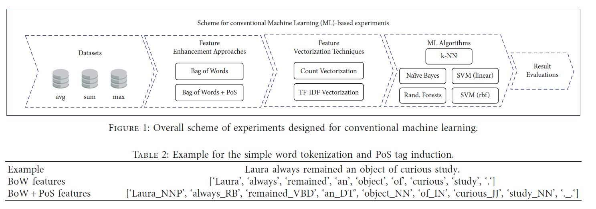
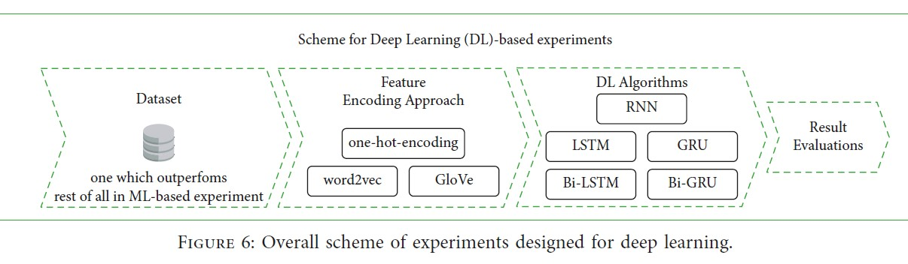

# Natural Language Processing

- [Natural Language Processing](#natural-language-processing)
	- [Introduction](#introduction)

## Introduction

NLP-Workflow: `Text -> Numbers -> Classification`

Machine Learning Approaches:

Deep Learning Approaches:

[Pic-Source](https://www.researchgate.net/publication/354354484_Automated_Prediction_of_Good_Dictionary_EXamples_GDEX_A_Comprehensive_Experiment_with_Distant_Supervision_Machine_Learning_and_Word_Embedding-Based_Deep_Learning_Techniques)